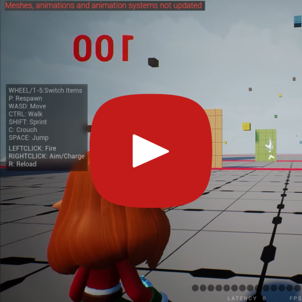
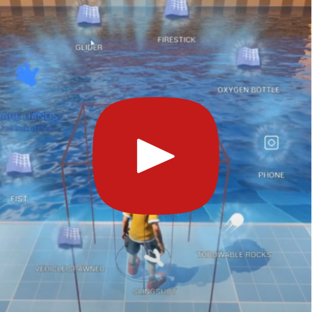

---
hide:
 - toc
 - path
 - title
---

#### Hi, Im a unreal engine generalist who intereseted in creating fun stuff and i started as a blender 3d hardsurface artists then done houdini kinefx rigging, maya rigging then created player controller, locomotion systems, chaos vehicles, game mechanics also little bit of replication in unreal engine,I also worked with a team around 5 people and used diversion version control with unreal for the past 3 years.

contact: gihankrox@gmail.com
discord: @gihanx

---
# SriVerse

An unreleased game iv worked on, primarily worked on player controller, vehicle system, weapon system, locomotion system, level sequencer cutscenes and some replication

#### Game Mechanics

#### Chaos Vehicles

#### Finalized Game mechanics

#### OnlyUp Game Mode

#### Multiplayer playtest held by me 

#### Winter theme

#### GTA Style Implementation

---
# Ashaa Meda Music Video

Me and another 2 guys worked on this, i mainly worked on sequencer for animating characters, facials, camera and vehicle then rendering part, assets are from marketplace

---
# ETX Commercial 2024

Me and another 2 guys worked on this, i did the sequencer part animating vehicles can camera also rendering, level is citysample and featured vehicle is modeled  by my friend

---
# Weapon Models

These are 3d models i did few years ago 

---
# Character Workflow

Workflows i have implemented with character artist

